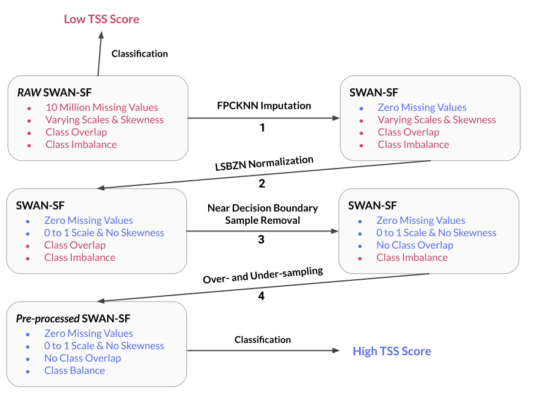
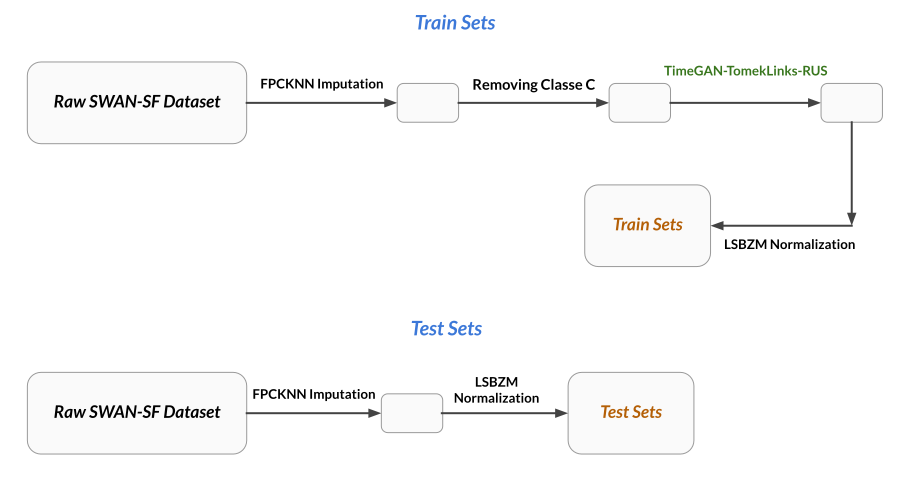

# Preprocessed-SWANSF

## Introduction
The **SWAN-SF dataset** is now fully preprocessed, optimized, and ready for binary classification tasks. Our team is excited to release the enhanced version of the SWAN-SF dataset across all five partitions. This version benefits from our **FPCKNN imputation** technique, the **elimination of Class C samples** to address class overlap issues, and the implementation of **TimeGAN**, **Tomek Links**, and **Random Under Sampling** as over- and under-sampling strategies. With **LSBZM normalization** applied, our optimized dataset empowers researchers to develop more precise classifiers by focusing on analysis rather than preprocessing steps, aiming to improve the TSS score significantly.



## Original Dataset
The unpreprocessed version of the SWAN-SF dataset can be accessed on the Harvard Dataverse:
- [SWAN-SF Dataset on Harvard Dataverse](https://dataverse.harvard.edu/dataset.xhtml?persistentId=doi:10.7910/DVN/EBCFKM)

For more detailed information about the SWAN-SF dataset, please refer to the following paper:
- [Flare Prediction from Multivariate Time Series Data of Photospheric Magnetic Field Parameters](https://www.nature.com/articles/s41597-020-0548-x)

## How to Use
Please download the dataset through the Google Drive link provided in the `download.txt` file.
The training partitions encompass every phase of our data preprocessing pipeline, including various sampling techniques. Conversely, the test partitions exclusively incorporate imputation and normalization procedures, without the application of any sampling techniques.




For each partition, data and labels are kept separate to maintain clarity and organization.<br/>

### Setup
Ensure you have `pickle` and `numpy` packages installed in your environment. Use the Python code below to load the data into an array:

```python
import pickle
import numpy as np

# Training Partitons
data_dir = "/path/to/your/Preprocessed_SWANSF/train/"
X_train = []
y_train = []
num_partitions = 5

for i in range(num_partitions):
    with open(f"{data_dir}Partition{i+1}_RUS-Tomek-TimeGAN_LSBZM-Norm_WithoutC_FPCKNN-impute.pkl", 'rb') as f:
        X_train.append(pickle.load(f))
    with open(f"{data_dir}Partition{i+1}_Labels_RUS-Tomek-TimeGAN_LSBZM-Norm_WithoutC_FPCKNN-impute.pkl", 'rb') as f:
        y_train.append(pickle.load(f))
```

```python
import pickle
import numpy as np

# Test Partitons
data_dir = "/path/to/your/Preprocessed_SWANSF/test/"
X_test = []
y_test = []
num_partitions = 5

for i in range(num_partitions):
    with open(f"{data_dir}Partition{i+1}_LSBZM-Norm_FPCKNN-impute.pkl", 'rb') as f:
        X_test.append(pickle.load(f))
    with open(f"{data_dir}Partition{i+1}_Labels_LSBZM-Norm_FPCKNN-impute.pkl", 'rb') as f:
        y_test.append(pickle.load(f))
```

### Data Structure
Each partition is stored in a 3D `.pkl` file, with the shape `(num_samples, num_timestamps, num_attributes)`.

### Attributes Order
The order of the attributes is as follows:
`['R_VALUE', 'TOTUSJH', 'TOTBSQ', 'TOTPOT', 'TOTUSJZ', 'ABSNJZH', 'SAVNCPP', 'USFLUX', 'TOTFZ', 'MEANPOT', 'EPSX', 'EPSY', 'EPSZ', 'MEANSHR', 'SHRGT45', 'MEANGAM', 'MEANGBT', 'MEANGBZ', 'MEANGBH', 'MEANJZH', 'TOTFY', 'MEANJZD', 'MEANALP', 'TOTFX']`

### Data Interpretation Examples
- `X_train[0][0,:,0]` corresponds to the `R_VALUE` attribute of the first sample of partition 1. This gives you the time series data for the `R_VALUE` attribute for the first sample.
- `X_train[3][20,:,1]` corresponds to the `TOTUSJH` attribute of the twenty-first sample of partition 4. Here, you're accessing the time series data for the `TOTUSJH` attribute for a specific sample in partition 4.

The `y_train` files hold the labels for the samples, organized in a 1D vector:
- `y_train[0][2]` corresponds to the label of the third Multivariate Time Series (MVTS) sample of partition 1, which can be 0 or 1, indicating the binary classification target.

### Copy Right
Our paper detailing this preprocessed dataset is currently under review. Please ensure to cite it appropriately once published.
